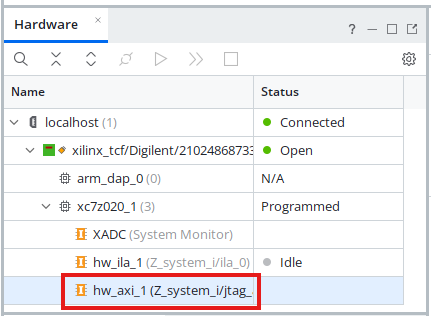

# Лабораторная работа 8

## Отладка аппаратных проектов Zynq

## Обзор

Часто, когда инженеры-аппаратчики создают новый IP, они хотят протестировать его не только с помощью симуляции, но и на аппаратном уровне. Но для встраиваемых проектов, таких как Zynq, требуется написать программное обеспечение для тестирования IP. В Vivado 2014.3 Xilinx представила новое ядро ​​LogiCORE™ IP JTAG-AXI, которое мы добавили в последней лабораторной работе. Это ядро ​​представляет собой настраиваемое ядро, которое может генерировать транзакции AXI и управлять сигналами AXI внутри AP SoC во время выполнения. Мы будем использовать это ядро ​​для тестирования нашего IP. Для запуска ядра JTAG-AXI мы будем использовать Vivado Logic Analyzer. Наконец, мы добавим готовое программное приложение для проверки нашего теста. Приложение будет включать процедуру обработки прерываний (ISR), которая обрабатывает прерывания от нашего пользовательского IP.

## Цель работы

После завершения лабораторной работы 8 вы будете знать, как выполнять следующие действия:

* Взаимодействовать с IP-ядрами в режиме реального времени
* Запускать программное обеспечение, которое обрабатывает прерывания, генерируемые PL, и использует процедуру обработки прерываний.


## Эксперимент 1: Импорт программного обеспечения

В этом эксперименте показано, как импортировать готовую рабочую область Vitis.

---

### **Обобщенная инструкция:**

Запустите рабочее пространство Lab 8 Vitis. Импортируйте существующий программный проект.

---

### **Пошаговая инструкция:**

1. Откройте Vivado и убедитесь, что реализованный дизайн открыт.

2. Экспортируйте аппаратный проект (*File -> Export -> Export Hardware*) в новую папку `ZynqDesign.lab8`, которая также будет служить новым рабочим пространством Vitis. Убедитесь, что вы экспортировали *bitstream*, а также IP-ядро в PL. Нажмите **«ОК»**.

    

3. Запустите *Vitis IDE*. Установите Workspace в только что созданную локацию **ZynqDesign.lab8/ZynqDesign.vitis**.

4. Создайте новый *Platform Component*, как это делалось в предыдущих работах. Убедитесь, что в созданной платформе присутствует PWM ядро.
    
    

5. Импортируйте приложения *Hello World*,* Memory Test* и *Peripheral Test* из созданного в третьей лабораторной работе архива. 

    

    

6. Проверьте, что платформа и приложения собираются и запускаются успешно. 

    

7. Создайте новый компонент из примера **Empty Application**. Укажите *LED_Dimmer_Int* в качестве имени.

    
    

8. Импортируйте в проект файл исходного кода *LED_Dimmer_Int.c*.

9. Скомпилируйте  проект. После завершения сборки приложения откройте исходный файл *LED_Dimmer_Int.c* для проекта **LED_Dimmer_Int**. Изучите код. Обратите внимание на функции ISR (PWMIsr) и настройки системы прерываний (SetupInterruptSystem).

---

### **Вопросы:**

Ответьте на следующие вопросы:

* Какая функция вызывается при обнаружении прерывания?

* Что делает функция PWMIsr?

* Какие действия выполняет функция PWMIsr со значением яркости?

* Что такое INTC_PWM_INTERRUPT_ID? Откуда взялось это число?

---
## Эксперимент 2: Vivado Hardware Analyzer

В ходе этого эксперимента показано, как запустить и настроить *Vivado Hardware Analyzer*. Мы будем регистрировать аппаратные события и использовать условия срабатывания (триггеры) по исключительным ситуациям для проверки аппаратной части проекта.

---

### **Обобщенная инструкция:**

Запрограммируйте ПЛИС (FPGA). Загрузите программное приложение на плату. Запустите *Vivado Hardware Analyzer*. Инициируйте события в Analyzer во время выполнения программы.

---

### **Пошаговая инструкция:**

1. Выполните загрузку проекта **LED_Dimmer_Int** на плату в программе *Vitis*. Убедитесь, что включено программирование ПЛИС.

2. Введите в терминале цифры от 0 до 9, чтобы проверить, работает ли код. Затем нажмите любую букву на клавиатуре — это должно вызвать исключение.

    

3. В Vivado раскройте **Open Hardware Manager** в Flow Navigator и выберите **Open target -> Auto Connect** для локального подключения. Для удаленного подключения используйте ручную настройку в **Open target -> Open New Target...**

    

4. Hardware Manager готов к работе. Если ​​ILA не запустился автоматом, то сделайте двойной щелчёк по названию чипа ( xc7020_1 )

    
    
5. В открывшимся окне *New Dashboard* выберете **hw_ila**. Проверьте, что в свойствах *Probes file* указан путь к **.ltx** файлу. **ЕСЛИ** файл отсутствует - найдите tcl консоль внизу и выполните команду  `write_debug_probes U:\ZynqLabs\ZynqDesign\ZynqDesign.ltx`, после чего укажите пусть к созданному файлу.

    

6. После запуска ILA нажмите кнопку **Trigger Immediate** на панели быстрого доступа. Логический анализатор немедленно захватит 1024 значения для всех сигналов. В зависимости от того, какое значение было введено последним, вы должны увидеть его в режиме отображения временных диаграмм. Для удобства измените систему счисления (*radix*) для **PWM_Counter** на десятичную без знака (*Unsigned Decimal*). Используйте кнопки управления масштабом для увеличения полученной временной диаграммы. 

    

7. Чтобы было удобно интерпретировать значения сигнала **DutyCycle**, также измените систему счисления для этого значения на десятичную без знака (Unsigned Decimal).

8. В терминале введите "**4**" и нажмите **Enter**. Снова запустите **Trigger Immediate**.

    

    Обратите внимание: параметр **DutyCycle** установлен на значение *440 000*, поскольку в терминал было введено число 4. Это верно, так как программное обеспечение в системе PS умножает введенное нами число на *110 000*. Напомним, что параметр периода определяет разрядность счетчика ШИМ. По умолчанию период равен 20, поэтому счетчик досчитывает примерно до 1 миллиона. Следовательно, любое число, превышающее 1 миллион, должно вызвать исключительную ситуацию и, как следствие, прерывание. Чтобы зафиксировать возникновение прерывания, нам потребуется настроить триггер в инструменте ILA.

9. Перейдите в окно настройки триггера (Trigger Setup) на вкладке **hw_ila_1**. Нажмите кнопку «**+**» и выберите сигнал **Interrupt_out**, чтобы добавить его в качестве пробника. Нажмите **OK**.

    

10. Нажмите левой кнопкой мыши на поле **Value** для сигнала **Interrupt_out** и измените значение на **R** (rising edge - передний фронт). 

    

11. Измените положение триггера на **256** и нажмите *ENTER*. Это установит точку срабатывания триггера ближе к началу диаграммы.

    

12. Нажмите кнопку *Run Trigger for this ILA core* на вертикальной панели быстрого доступа, чтобы подготовить ядро ​​к работе. Введите в терминале несколько чисел, чтобы проверить, сработает ли триггер. Если этого не произойдет, статус захвата триггера (Trigger Capture Status) по-прежнему должен отображаться как **Waiting for Trigger** (Ожидание триггера).

    

13. Теперь введите какой-либо символ в терминале.

14. Состояние триггера должно измениться с **Full** на **Idle**. Вернитесь к режиму отображения диаграммы и уменьшите масштаб. Срабатывание триггера (Т) и прерывание должны были произойти ровно в тот момент, когда коэффициент заполнения (Duty Cycle) превысил максимальное значение счетчика ШИМ.
    
    

---

### **Вопросы:**

* Можете ли вы определить, сколько времени требуется процессору для обработки прерывания?
---

## Эксперимент 3: Взаимодействие с AXI во время выполнения программы

Зачастую инженеры-разработчики аппаратного обеспечения не имеют готового программного кода к моменту, когда им необходимо протестировать свои IP-блоки. Именно поэтому компания Xilinx разработала ядро ​**​LogiCORE™ IP JTAG-AXI**. В рамках данного эксперимента демонстрируется порядок взаимодействия с ядром **JTAG-AXI**. Мы будем выполнять транзакции AXI через мастер-интерфейс **AXI JTAG** с помощью команд **TCL**, осуществляя таким образом взаимодействие в процессе работы системы для тестирования IP-блоков.

В данный момент программное обеспечение выполняется на подсистеме PS и передает команды периферийным устройствам через блок AXI Interconnect.


В случае использования ядра AXI-JTAG Master команды для выполнения транзакций AXI поступают из цепочки JTAG через Vivado Logic Analyzer и команды TCL.


---

### **Обобщенная инструкция:**

Выполняйте AXI-транзакции с помощью команд TCL, одновременно отслеживая работу ядра ILA.

---

### **Пошаговая инструкция:**

1. В Hardware Manager найдите консоль TCL.

    

2. Также найдите имя нашего ведущего устройства AXI-JTAG.

    

3. Первым делом необходимо сбросить интерфейс AXI; для этого введите команду TCL:

    ```tcl
    reset_hw_axi [get_hw_axis hw_axi_1]
    ```

4. Прежде чем выполнять транзакции AXI, нам нужно знать адрес наших периферийных устройств. Как вы, возможно, помните, в нашей блок-схеме (block design) были назначены следующие адреса:

    

5. Следующий шаг — создание команды транзакции AXI. Приведенная ниже команда инициирует операцию записи AXI по заданному адресу с указанными данными. Выполните эту TCL-команду:

    ```tcl
    create_hw_axi_txn write_txn [get_hw_axis hw_axi_1] -type WRITE -address 43C00000 -len 1 -data 000A1220
    ```
    * **write_txn** — имя транзакции
    * **[get_hw_axis hw_axi_1]** возвращает объект hw_axi_1
    * **-address 43C00000** — начальный адрес
    * **-len 1** задает длину пакета (burst length) AXI, равную 1 слову
    * **-data 000A1220** — передаваемые данные
        * Это соответствует уровню яркости **6** (в десятичном формате — *660000*)

6. После создания команды ее можно выполнить с помощью следующей команды TCL. Запишите значение яркости в периферийный модуль контроллера ШИМ (PWM Controller).

    ```tcl
    run_hw_axi [get_hw_axi_txns write_txn]
    ```
    
7. Выполните немедленный запуск (Trigger Immediate) и откройте окно просмотра временных диаграмм. Теперь значение яркости должно быть установлено равным 660 000.

    

8. Чтобы изменить данные для записи в транзакции **write_txn**, достаточно отредактировать поле **DATA** этой команды:

    ```tcl
    set_property DATA 000FFFFF [get_hw_axi_txns write_txn]
    ```

9. В Analyzer выберите режим **Run Trigger** (а не Trigger Immediate).

10. Затем выполните команду **run_hw_axi**:

    ```tcl
    run_hw_axi [get_hw_axi_txns write_txn]
    ```

11. Представление временных диаграмм должно обновиться и отобразить возникшее исключение.

    


12. Попробуйте считать данные из BRAM. Снова сначала создайте команду:

    ```tcl
    create_hw_axi_txn read_txn [get_hw_axis hw_axi_1] -type READ -address 40000000 -len 4
    ```

13. Затем выполните команду:
    
    ```tcl
    run_hw_axi [get_hw_axi_txns read_txn]
    ```

    Результат в консоли TCL должен выглядеть следующим образом:

    

14. Создайте новую транзакцию записи AXI для BRAM:

    ```tcl
    create_hw_axi_txn write_bram [get_hw_axis hw_axi_1] -type WRITE -address 40000000 -len 4 -data {44444444_33333333_22222222_11111111}
    ```

15. Затем выполните новую команду записи в BRAM:

    ```
    run_hw_axi [get_hw_axi_txns write_bram]
    ```

16. Снова считайте содержимое BRAM, чтобы проверить, обновились ли данные, выполнив команду:
    
    ```tcl
    run_hw_axi [get_hw_axi_txns read_txn]
    ```
    
    

    Подводя итог, отметим, что ядро ​​JTAG-to-AXI Master легко интегрируется в проект. Кроме того, с помощью команд TCL можно быстро и просто выполнять операции чтения и записи при взаимодействии с любым периферийным устройством (ведомым узлом) интерфейса AXI, используемым в проекте.
    


    


